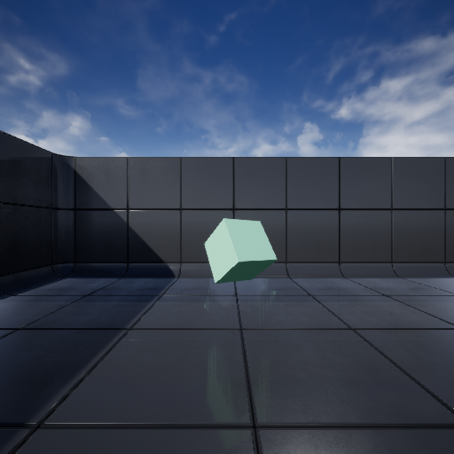

# SyntheticShapesData
Synthetic data containing Cubes, Cuboids, Spheres and Cylinders on a static background.

## Dataset description
This dataset was artificially generated using Unreal Engine v4.22 and [NVIDIA Deep learning Dataset Synthesizer (NDDS)](https://github.com/NVIDIA/Dataset_Synthesizer).

The dataset consists of 30k images of cubes, cuboids, spheres and cylinders rendered against a static background.
It is split up into a train (24K) and test split (6K).
In each image 0-4 objects (all of distinct classes) are spawned randomly in the scene. 
Objects are spawned with a random orientation, location and color in the scene.
The camera location and orientation is static, as well as the background and scene objects are placed in.
Objects can spawn half out-of-frame, or be occluded by other objects. In these cases, the target masks only contain visible parts of the object, occluded parts are not considered to be part of an object inthe output mask.

## Dataset sample

### Individual objects
Example shape Images             |  Corresponding Mask
:-------------------------:|:-------------------------:
  |  
  |  
  |  
  |  

### Multiple objects
Multiple objects can be spawned in the same scene. 
Different objects always have different classes, this dataset does not contain instances where multiple objects of the same class are present in the same scene.
Target masks only contain visible parts of the objects.
Sample Images             |  Corresponding Mask
:-------------------------:|:-------------------------:
  |  
  |  
  |  

### Special cases
The dataset contains multiple images where no objects are spawned in the scene. This results in a completely empty output mask. 
Besides this, objects can spawn half out-of-frame. In these cases, the target masks only contain the parts of the object within the frame.

Sample Images             |  Corresponding Mask
:-------------------------:|:-------------------------:
  |  
  |  

## Dataset usage
Complying with the [NVIDIA Deep learning Dataset Synthesizer licence](https://github.com/NVIDIA/Dataset_Synthesizer/blob/master/LICENSE.txt), this dataset follows the [Creative Commons Licence CC BY-NC-SA 4.0](LICENCE.txt). Thus, this dataset is freely available for academic purpose or individual research, but restricted for commecial use.
